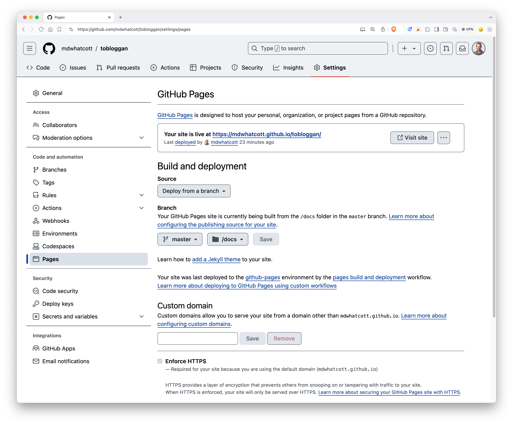

# tobloggan

_Blogging made so easy you might as well be coasting smoothly down a snowy mountain track without a care in the world._

- Run `make test` to execute tests.
- Run `make dev` to generate the blog from the `/content` directory and open a web browser to view the pages in the `/generated` directory.
- Run `make publish` to generate the blog from the `/content` directory to the `/docs` directory. Will also commit and push the blog (to kickoff a build of github pages, if configured).

## Github Pages Configuration




## Content Files

Consider a text file called `article.md` with the following contents:

```text
{
    "draft": true,
    "slug": "/the-path/of-the/article",
    "title": "The Title of the Article",
    "date": "2024-09-25T00:00:00Z"
}

+++

## Markdown content here

This will be a paragraph with _italic_ text and *bold* text.

```

Some facts about content files and their structure:

1. All content files must end in `.md`.
2. The first element of a content file is a JSON object with the following keys:
   - `draft` (boolean) If `true`, the article will not be published.
   - `slug` (string) The unique URL path of the article.
   - `title` (string) The text to use as the `<h1>` of the article.
   - `date` (string, RFC3339 formatted date) If future, the article will not be published.
3. The second element of a content file is the separator `+++`.
4. The third element of a content file is arbitrary content, formatted as markdown (which will be converted to HTML).
